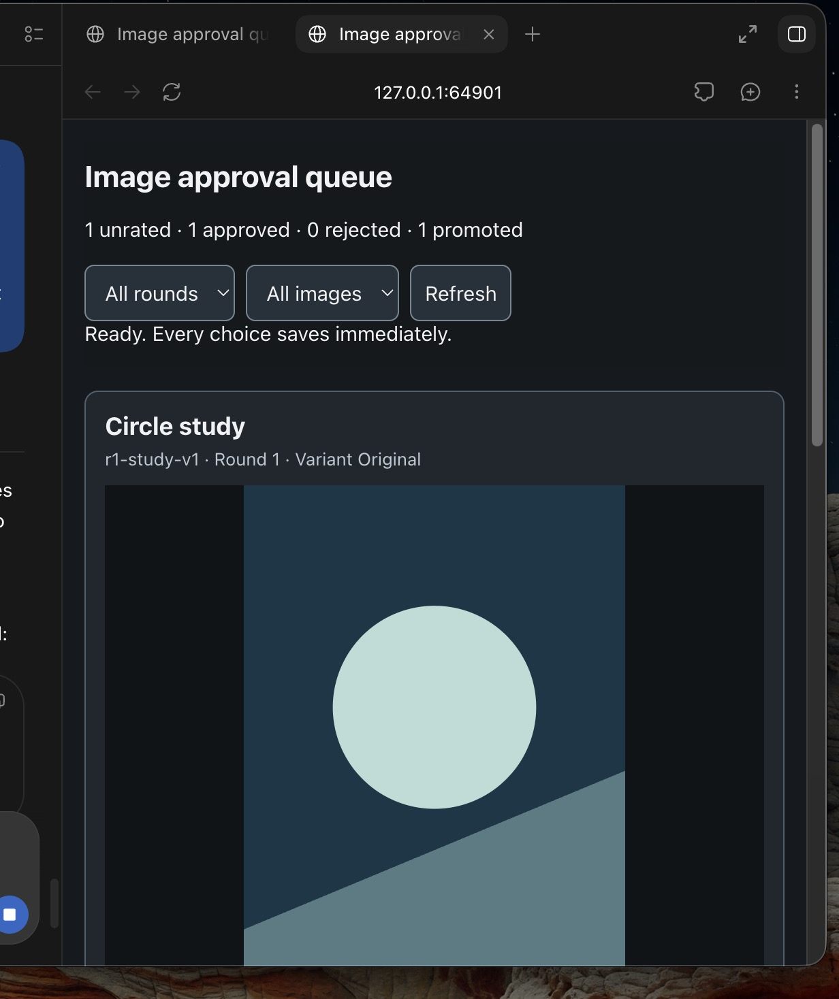
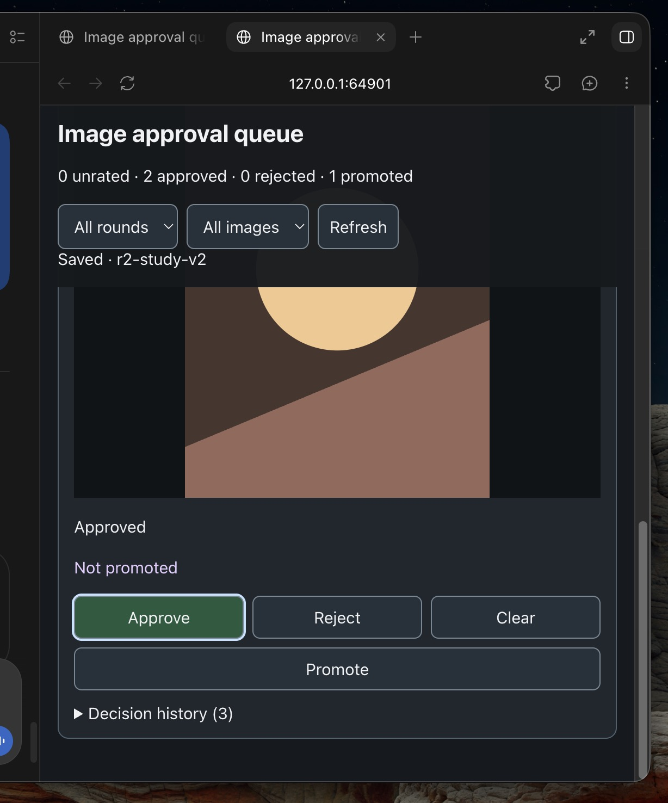

# Image Approval Queue

This skill adds a local review panel to image work in Work/Codex. A person can look through images, approve or reject each one, clear a rating, and separately promote images for a particular purpose. Choices save as they are made and remain available when more images are added later.

Other AI systems may adapt the [skill instructions](SKILL.md) to their own local tools. The included Python app is one ready-made implementation; the skill also describes how to build an equivalent queue when that app is unsuitable.

## Example Screenshots

## For people

In Codex, provide this repository URL and ask it to install the skill. Then ask something natural, such as:

> Add an approval queue to the images we just made. Open it for review.

Or, for existing images:

> Open a review queue for the images in this folder.

Codex should find the images and set up the queue. There is no need to prepare a list of filenames. After a new image round, ask Codex to add it to the same queue. Earlier choices should remain. 

If Codex asks where the skill is, specify the repository root—the folder containing SKILL.md.

Approve and Reject record a rating. Clear removes that rating. The extra Promote button is independent, so an image can be promoted while still unrated. For book covers or another specific purpose, the button can have a more useful name such as “Mark as cover.”

## For Codex and other AIs

Read [SKILL.md](SKILL.md). It specifies image discovery, integration after each round, persistent review state, variants, interface behavior, and verification. [references/usage.md](references/usage.md) documents the included app and its file format. The human should not need to create those files manually.

The ready-made app runs locally with Python 3.9+ on macOS or Linux and needs no extra packages. The `examples/` folder contains simple SVG shapes for a no-cost test. These are placeholders, not generated images.

## Future extension

Per-image regeneration with written steering is planned but not implemented. A future Regenerate action should preserve the original and add the result as a new variant with its own review choices.
